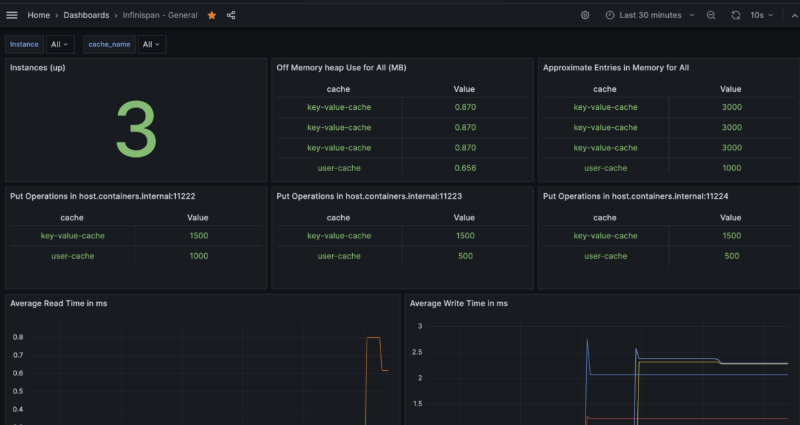
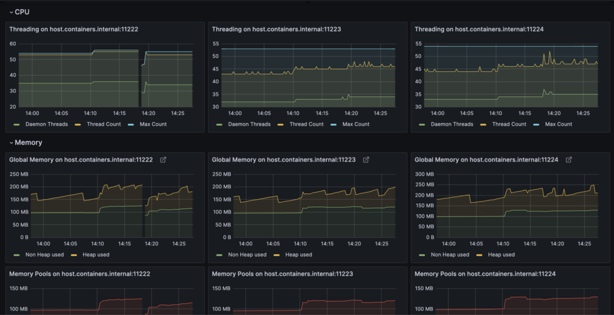

# Grafana Dashboard to Display Infinispan 14 Statistics

## How To
Infinispan 14, or Red Hat DataGrid 8.4, has an endpoint which displaying statistics (`http://ip:11222/metrics`). We can consume it by using `Prometheus` and visualize it by using `Grafana`.

## Screenshot




## Troubleshooting
It is necessary to replace `prometheus datasource` uid which is hardcoded in the json file, with your own `datasource` uid in order to make this Dashboard works. 
```json
"datasource": {
        "type": "prometheus",
        "uid": "eb756797-79c7-4893-bcc9-c4bfdc7c457d"
      },
```